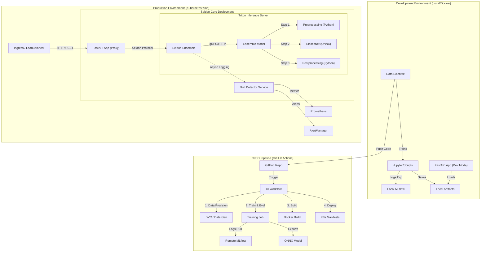
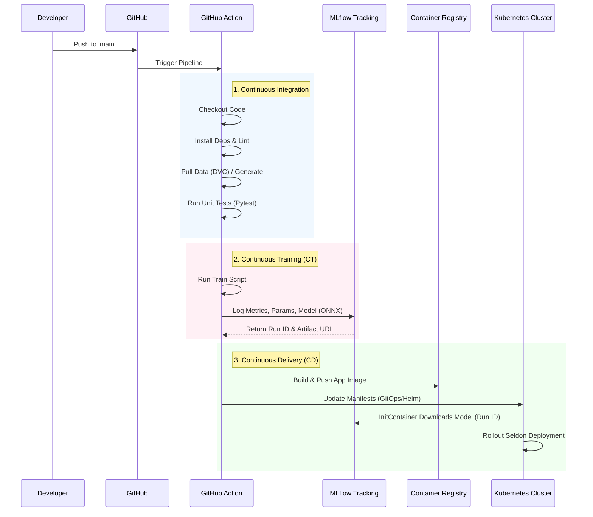
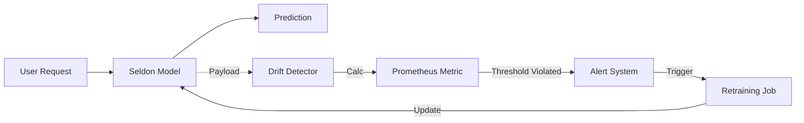
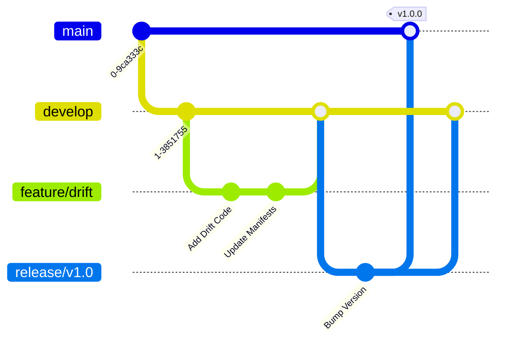

# MLOps System Architecture & Process Documentation

This document details the end-to-end MLOps architecture, Software Development Life Cycle (SDLC), CI/CD workflows, and branching strategies implemented for the Wine Quality Prediction system.

## 1. High-Level Architecture

The system follows a **Hybrid Deployment Pattern**, bridging local development flexibility with a robust Kubernetes-based production environment using Seldon Core and NVIDIA Triton Inference Server.

### System Components Flow

---

## 2. Software Development Life Cycle (SDLC) Phases

The lifecycle is divided into 5 distinct phases, ensuring code and model quality before production deployment.

| Phase | Activity | Tools/Tech | Outcome |
| :--- | :--- | :--- | :--- |
| **1. Data Ops** | Data generation, cleaning, versioning. | DVC, Pandas, Python | Versioned Dataset (`.dvc` files) |
| **2. Model Dev** | Feature engineering, training, hyperparam tuning. | Jupyter, Scikit-Learn, MLflow | Trained Model Artifacts, Experiment Logs |
| **3. Integration** | Packaging model code, creating Docker containers, unit tests. | Docker, Pytest, Makefile | Docker Images, Test Reports |
| **4. Deployment** | Deploying to Staging/Prod, configuring Inference Graph. | Kubernetes, Seldon Core, Triton | Running Inference Service |
| **5. Monitoring** | Tracking drift, latency, and errors. Feedback loop. | Alibi Detect, Prometheus, Grafana | Live Metrics, Drift Alerts |

---

## 3. CI/CD & Drift Feedback Loop

### CI/CD Workflow (GitHub Actions)

The pipeline automates the path from code commit to deployed service.

### Drift Detection Feedback Loop

This loop ensures the model remains valid over time.

1.  **Inference**: User sends data to `WineApp`.
2.  **Logging**: `Seldon Core` asynchronously forwards the request payload to `Drift Detector`.
3.  **Analysis**: `Alibi Detect` (running in `Drift Detector`) compares the live batch against the Reference Training Data.
4.  **Metric**: If drift is detected (p-value < threshold), `seldon_metric_drift_found` is set to 1.
5.  **Alert**: Prometheus scrapes the metric; AlertManager triggers notification.
6.  **Action**: Triggers a **Retraining Pipeline** (CT) on new data.

---

## 4. Branching Strategy

We utilize a **GitFlow-inspired** strategy adapted for MLOps to manage code and model versions stability.

### Branches

1.  **`main` (Production)**
    *   **Purpose**: Stable, deployable code. Reflects what is running in the Production environment.
    *   **Protection**: Protected branch. Requires Pull Request (PR) approval and passing CI checks.
    *   **Deployment**: Automatically deploys to Production Cluster upon merge.

2.  **`develop` (Integration/Staging)**
    *   **Purpose**: Integration branch for features. Reflects the Staging environment.
    *   **Deployment**: Automatically deploys to Staging Cluster (e.g., `namespace: staging`) for end-to-end testing.

3.  **`feature/*` (Feature Development)**
    *   **Purpose**: Short-lived branches for new features, experiments, or model improvements.
    *   **Naming**: `feature/add-drift-detection`, `feature/xgboost-model`.
    *   **Workflow**: Branch from `develop`, work locally, PR to `develop`.

4.  **`experiment/*` (Data Science Experiments)**
    *   **Purpose**: Sandbox for Data Scientists to try radical model changes without affecting engineering code.
    *   **Note**: Often these don't merge directly but result in updated training scripts or parameters moved to `feature` branches.

### Workflow Stages

#### Stage 1: Feature Development
*   **Action**: Create `feature/new-model` from `develop`.
*   **Work**: Modify `train.py`, update `parameters.yaml`.
*   **Test**: Run `make test` locally.

#### Stage 2: Pull Request & Review
*   **Action**: Open PR `feature/new-model` -> `develop`.
*   **CI Checks**:
    *   Code Linting.
    *   Unit Tests.
    *   *Small-scale* training run to verify script integrity.
*   **Review**: Peers review code and initial model metrics.

#### Stage 3: Staging Deployment
*   **Action**: Merge to `develop`.
*   **CD**: Deploys to Kubernetes `dev`/`staging` namespace.
*   **Verification**: Run integration tests and drift simulations.

#### Stage 4: Production Release
*   **Action**: Create Release PR `develop` -> `main`.
*   **CD**: Deploys to Kubernetes `prod` namespace.
*   **Tagging**: Semantic version tag (e.g., `v1.2.0`) created for rollback capability.

### Visual Guide

